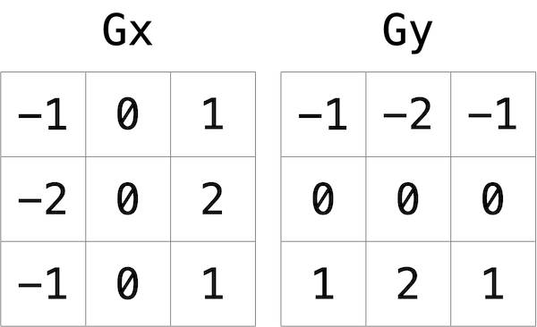

# c_77_BMP_filter

## DESCRIPTION

Open a BMP file then apply a filter on the picture and save it in a new file.

[Informations about BMP file structure](https://en.wikipedia.org/wiki/BMP_file_format)

### IMPLEMENTATION DETAILS

- read file name (or path) from command line argument

- make sure the file is a BMP image

- create a structure to save all the BMP header and DIB infromation

- read in all the BMP header information and print them on screen

- read pixel data into a two dimensional array

- create functions to apply:
  - grayscale
  - sepia
  - blur
  - edges

- save the edited image as a new image

#### Grayscale

One common filter is the “grayscale” filter, where we take an image and want to convert it to black-and-white. How does that work?

If the red, green, and blue values are all set to 0x00 (hexadecimal for 0), then the pixel is black. And if all values are set to 0xff (hexadecimal for 255), then the pixel is white. So long as the red, green, and blue values are all equal, the result will be varying shades of gray along the black-white spectrum, with higher values meaning lighter shades (closer to white) and lower values meaning darker shades (closer to black).

So to convert a pixel to grayscale, we just need to make sure the red, green, and blue values are all the same value. But how do we know what value to make them? Well, it’s probably reasonable to expect that if the original red, green, and blue values were all pretty high, then the new value should also be pretty high. And if the original values were all low, then the new value should also be low.

In fact, to ensure each pixel of the new image still has the same general brightness or darkness as the old image, we can take the average of the red, green, and blue values to determine what shade of grey to make the new pixel.

Apply that to each pixel in the image, the result will be an image converted to grayscale.

#### Sepia

Most image editing programs support a “sepia” filter, which gives images an old-timey feel by making the whole image look a bit reddish-brown.

An image can be converted to sepia by taking each pixel, and computing new red, green, and blue values based on the original values of the three.

There are a number of algorithms for converting an image to sepia, but we'll use the following algorithm. For each pixel, the sepia color values should be calculated based on the original color values per the below.

```c
  sepiaRed = .393 * originalRed + .769 * originalGreen + .189 * originalBlue
  sepiaGreen = .349 * originalRed + .686 * originalGreen + .168 * originalBlue
  sepiaBlue = .272 * originalRed + .534 * originalGreen + .131 * originalBlue
```

Of course, the result of each of these formulas may not be an integer, but each value could be rounded to the nearest integer. It’s also possible that the result of the formula is a number greater than 255, the maximum value for an 8-bit color value. In that case, the red, green, and blue values should be capped at 255. As a result, we can guarantee that the resulting red, green, and blue values will be whole numbers between 0 and 255, inclusive.

#### Blur

There are a number of ways to create the effect of blurring or softening an image. For this problem, we’ll use the “box blur,” which works by taking each pixel and, for each color value, giving it a new value by averaging the color values of neighboring pixels.

Consider the following grid of pixels, where we’ve numbered each pixel.


The new value of each pixel would be the average of the values of all of the pixels that are within 1 row and column of the original pixel (forming a 3x3 box). For example, each of the color values for pixel 6 would be obtained by averaging the original color values of pixels 1, 2, 3, 5, 6, 7, 9, 10, and 11 (note that pixel 6 itself is included in the average). Likewise, the color values for pixel 11 would be be obtained by averaging the color values of pixels 6, 7, 8, 10, 11, 12, 14, 15 and 16.

For a pixel along the edge or corner, like pixel 15, we would still look for all pixels within 1 row and column: in this case, pixels 10, 11, 12, 14, 15, and 16.

#### Edges

In artificial intelligence algorithms for image processing, it is often useful to detect edges in an image: lines in the image that create a boundary between one object and another. One way to achieve this effect is by applying the [Sobel operator](https://en.wikipedia.org/wiki/Sobel_operator) to the image.

Like image blurring, edge detection also works by taking each pixel, and modifying it based on the 3x3 grid of pixels that surrounds that pixel. But instead of just taking the average of the nine pixels, the Sobel operator computes the new value of each pixel by taking a weighted sum of the values for the surrounding pixels. And since edges between objects could take place in both a vertical and a horizontal direction, you’ll actually compute two weighted sums: one for detecting edges in the x direction, and one for detecting edges in the y direction. In particular, you’ll use the following two “kernels”:



How to interpret these kernels? In short, for each of the three color values for each pixel, we’ll compute two values `Gx` and `Gy`. To compute `Gx` for the red channel value of a pixel, for instance, we’ll take the original red values for the nine pixels that form a 3x3 box around the pixel, multiply them each by the corresponding value in the `Gx` kernel, and take the sum of the resulting values.

Why these particular values for the kernel? In the `Gx` direction, for instance, we’re multiplying the pixels to the right of the target pixel by a positive number, and multiplying the pixels to the left of the target pixel by a negative number. When we take the sum, if the pixels on the right are a similar color to the pixels on the left, the result will be close to 0 (the numbers cancel out). But if the pixels on the right are very different from the pixels on the left, then the resulting value will be very positive or very negative, indicating a change in color that likely is the result of a boundary between objects. And a similar argument holds true for calculating edges in the y direction.

Using these kernels, we can generate a Gx and Gy value for each of the red, green, and blue channels for a pixel. But each channel can only take on one value, not two: so we need some way to combine Gx and Gy into a single value. The Sobel filter algorithm combines Gx and Gy into a final value by calculating the `square root of Gx^2 + Gy^2`. And since channel values can only take on integer values from 0 to 255, be sure the resulting value is rounded to the nearest integer and capped at 255!

And what about handling pixels at the edge, or in the corner of the image? There are many ways to handle pixels at the edge, but for the purposes of this problem, we’ll ask you to treat the image as if there was a 1 pixel solid black border around the edge of the image: therefore, trying to access a pixel past the edge of the image should be treated as a solid black pixel (values of 0 for each of red, green, and blue). This will effectively ignore those pixels from our calculations of Gx and Gy.